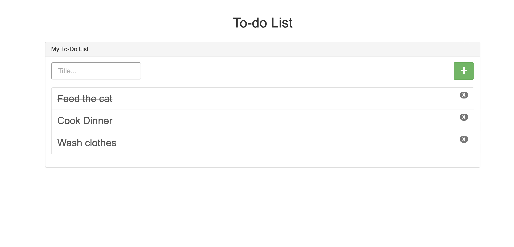

## todo_list

These php files are the basis of a website that is able to store an input from the user as a to do list

In the title section you can add an input to add something on your todo list.

By clicking on an element in the to do list, you can cross it off.

To delete an element, click on the red box on the right hand side.

